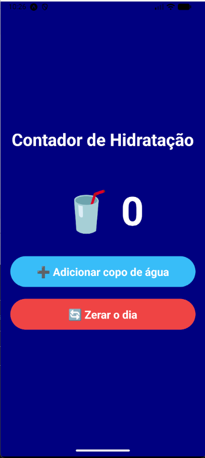
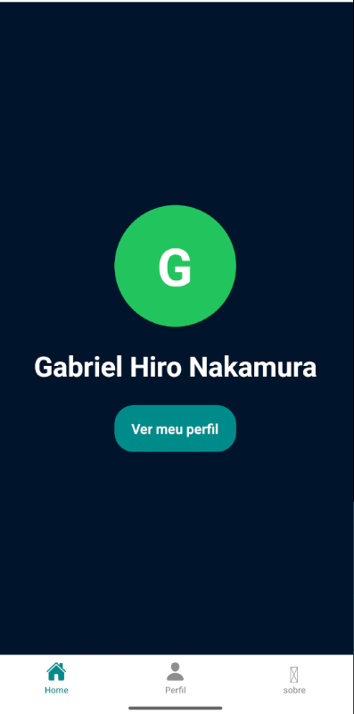
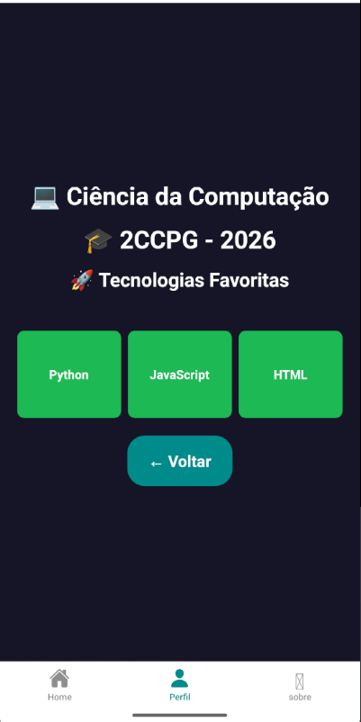
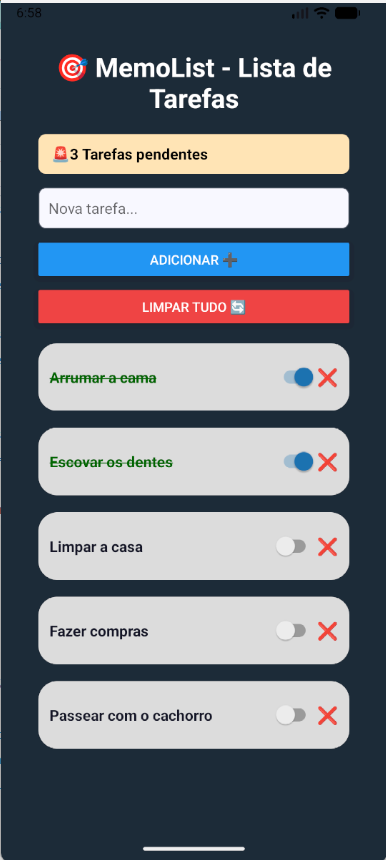
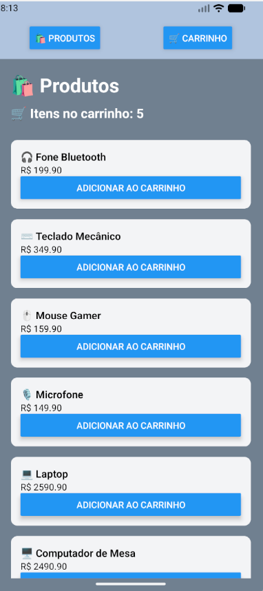
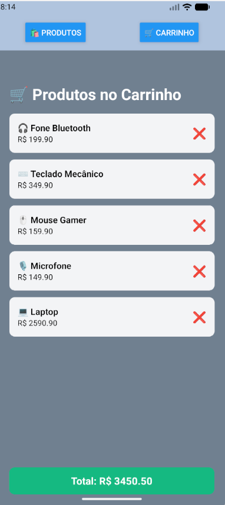
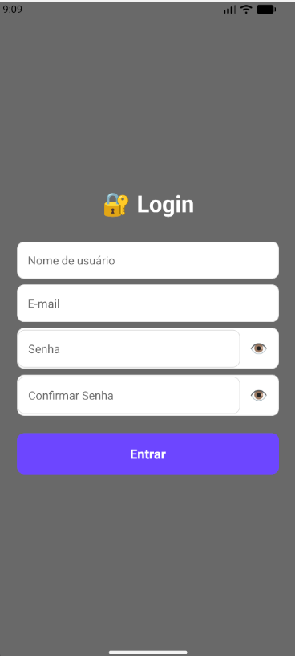
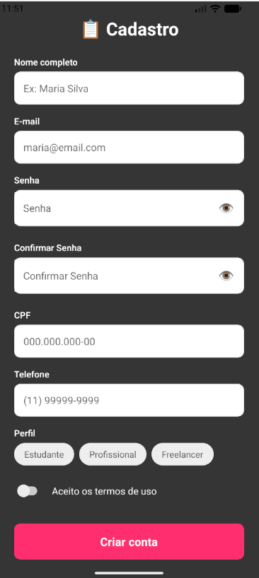

# FIAP-CPAD-CP3

## Identificação

* **Gabriel Hiro Nakamura**
* **RM-562221**
* **2CCPG**

**Índice de Exercícios:**

| Aula | Exercício | Pasta |
|------|-----------|-------|
| 03   | Cartão de Visita Digital | [aula03-cartao-visita](./aula03-cartao-visita/meu-perfil) |
| 04   | Contador de Hidratação   | [aula04-contador-hidratacao](./aula04-contador-hidratacao/meu-app) |
| 05   | Meu Perfil | [aula05-meu-perfil](./aula05-meu-perfil/app-router) |
| 06   | MemoList | [aula06-memolist](./aula06-memolist/Memolist) |
| 07   | Mini Loja | [aula07-mini-loja](./aula07-mini-loja/mini-loja) |
| 08   | Mini Login | [aula08-mini-login](./aula08-mini-login/mini-login) |
| 09   | Cadastro | [aula09-cadastro-completo](./aula09-cadastro-completo/cadastro-app) |

---


## Como Rodar o Projeto

1. **Clone o repositório:**
```bash
   git clone https://github.com/Gabriel-H182007/fiap-cpad-cp3.git
```
2. **Acesse a pasta do projeto**
```bash
  cd fiap-cpad-cp3/aula03-cartao-visita
   ```
3. **Instale as dependências:**
```bash
   npm install
   ```
4. **Inicie o servidor de desenvolvimento:**
```bash
   npx expo start
   ```

--- 

## Documentação dos Exercícios e Demonstração Visual

## Aula 03 — Cartão de Visita

Aplicativo simples de um cartão de visita. Nele praticamos o JSX e os componentes básicos do React Native, utilizando componentes core como `View`, `Text`, `Image` e `TouchableOpacity` para simular um cartão de visita com foto simulada, informações pessoais, links visuais e estilização do app com `StyleSheet`. 


---

## Aula 04 — Contador de Hidratação

Aplicativo simples para contar o consumo de água. Nele praticamos o `useState` para controlar
o contador de copos, `useEffect` para detectar quando a meta diária de 8 copos é
atingida, e estilização do app com `StyleSheet`.



---

## Aula 05 — Meu Perfil

Aplicativo simples de um perfil pessoal com 2 telas. Nele praticamos a navegação utilizando Expo Router, organização de Layout e estilização com `StyleSheet`. No app, a primeira tela possui uma foto de perfil, nome e um botão para a segunda tela, que possui informações acadêmicas e tecnologias favoritas.

 | 

---

## Aula 06 — MemoList

Aplicativo simples de lista de tarefas. Nele usamos  o `AsyncStorage` para persistir os dados da lista de tarefas quando o app é fechado, além de fazermos o uso de Flatlist, TextInput e Switch. O aplicativo foi estilizado com `StyleSheet` e permite adicionar, remover e concluir tarefas que são salvas.



---

## Aula 07 — Mini Loja

Aplicativo de mini loja desenvolvido para praticar os conceitos de gerenciamento de estado global com `Context API` e Mock de Dados. Esse app foi estilizado com  `StyleSheet` e permite ao usuário ver a lista de produtos disponíveis e adicioná-los ao carrinho, além de ser possível observar o valor total da compra.


 | 

---

## Aula 08 — Mini Login

Aplicativo de formulário simples. Nele praticamos conceitos básicos de formulários, validação de erros e UX. Esse app foi estilizado com  `StyleSheet` e permite ao usuário fazer um login preenchendo os campos de Nome, email, senha e confirmar senha, além de que quando os campos estiverem válidos a cor do botão é alterada para verde



---

## Aula 09 — Cadastro

Aplicativo de cadastro completo. Nele praticamos o uso de máscaras de input, validações avançadas, UX e navegação entre campos com ref. Esse app foi estilizado com  `StyleSheet` e permite que o usuário faça um cadastro completo com validação inline, chips de perfil, switch e uso de `useRef` para mudar de campo.



---


## Reflexão Final

Ao longo da disciplina eu pude perceber a minha evolução na matéria, principalmente ao aplicar os conceitos e conteúdos em cada desafio realizado. Além disso, um dos maiores desafios que enfrentei foi a parte de gerenciamento de estado global e persistência de dados, pois no início tive dificuldade para entender e aplicar esses conceitos nas atividades, mas com o passar das aulas consegui superar esses obstáculos através da prática. Um dos conteúdos que eu mais aprendi foi o de formulários, em que consegui aplicar validações, máscaras e melhorias de UX nos exercícios realizados. Pretendo levar esses conhecimentos, juntamente com os conceitos de experiência do usuário, para futuros projetos.

```
